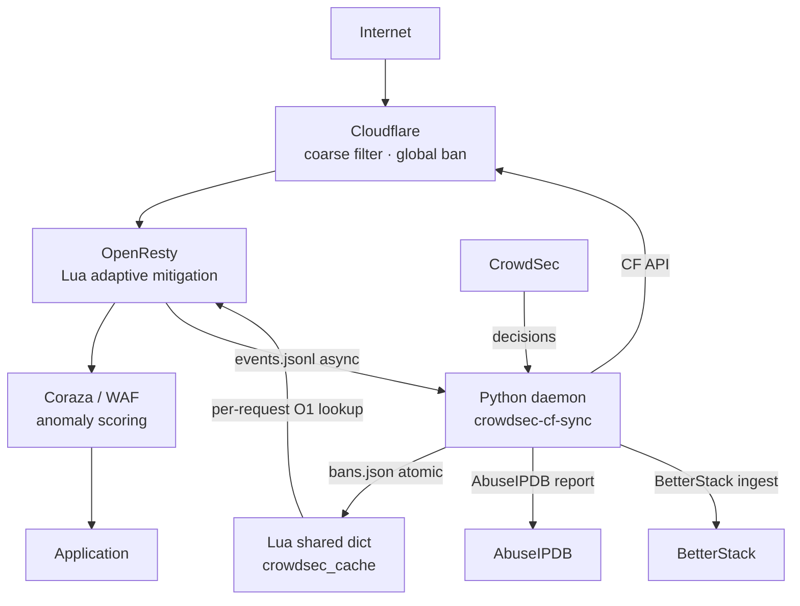

# crowdsec-cf-sync

A Python daemon that bridges [CrowdSec](https://www.crowdsec.net/) and [Cloudflare](https://www.cloudflare.com/) Firewall, with AbuseIPDB reporting, recidivist escalation, ModSecurity-based instant bans, and automatic /24 CIDR blocking.

One active script; previous versions archived:

| File | Version | Status |
|---|---|---|
| `crowdsec-cf-syncV3.py` | **3.2.0** — recommended | Active, production-ready |
| `archived/crowdsec-cf-syncV2.py` | 2.0.0 | Archived, kept for reference |
| `archived/crowdsec-cf-sync.py` | 1.0.0 | Archived, kept for reference |

## Features

- **CrowdSec → Cloudflare sync** — pushes active local bans (origin `crowdsec`/`cscli`) to Cloudflare IP Access Rules every 60 seconds
- **AbuseIPDB reporting** — reports newly banned IPs with scenario context and recent nginx URIs
- **Recidivist escalation** — tracks repeat offenders: 2nd ban → 24h Cloudflare block, 3rd+ → 7 days
- **ModSecurity instant ban** — ModSecurity anomaly score ≥ 5 → immediate 2h Cloudflare block + AbuseIPDB report
- **Auto /24 CIDR block** — when 2+ distinct IPs from the same /24 are banned within 7 days, the entire subnet is blocked for 24h
- **Cloudflare WAF polling** — detects mass-hits on WAF rules and escalates via CrowdSec

### V3 additions (3.0.0)

- **Anti-self-ban** — immutable protected ranges (RFC1918, Cloudflare anycast, Tailscale CGNAT, own IPs) guard every `add_cf_rule()` call
- **Circuit breakers** — graceful degradation when Cloudflare, CrowdSec, or AbuseIPDB APIs are down; auto-reset after configurable timeout
- **DRY_RUN / shadow mode** — `CF_DRY_RUN=1` simulates without applying; safe for testing against production state
- **Health + Prometheus metrics** — `http://127.0.0.1:CF_HEALTH_PORT/health` (JSON) and `/metrics` (Prometheus text); scrape-ready for Grafana
- **WAL (Write-Ahead Log)** — append-only journal at `/var/log/crowdsec/cf-sync-wal.jsonl` for every Cloudflare operation
- **SIGHUP hot reload** — reload allowlist and config without daemon restart
- **sd_notify watchdog** — native systemd `WatchdogSec=` integration via `NOTIFY_SOCKET`
- **Adaptive mitigation** — `CF_MIN_CONFIDENCE` gates scenarios by confidence level (low / medium / high)
- **Rule collapsing** — `ipaddress.collapse_addresses()` coalesces adjacent IPs into minimal CIDR set before CF batch
- **Drift detection** — periodic reconciliation (default 300s) removes orphaned CF rules and re-adds missing bans; alerts BetterStack on drift
- **Recidivist cursor** — cursor-based dedup prevents re-counting ban events across restarts

### V3.2.0 additions — OpenResty Lua orchestration layer



**Mitigation levels** (per-IP, score-driven):

| Score | Level | Action |
|---|---|---|
| 0 | L0 | Allow |
| 1–30 | L1 | Rate limit (30 req/60s) |
| 31–60 | L2 | Tarpit (3–12s sleep, bounded to 20 concurrent) |
| 61–80 | L3 | JS challenge hint (429 + header) |
| 81–95 | L5 | 403 Forbidden |
| 96–100 | L5 | 444 Silent drop |

**Key properties:**
- Zero per-request I/O — lookup is pure shared dict read
- Fail-open: if bans.json absent → allow (Cloudflare still blocks known bans)
- Atomic IPC: Python → Lua via fsync+rename; Lua → Python via rename (race-free)
- Sequence guard: Lua rejects stale or replayed sync files (monotonic version)
- Entry count integrity: Lua rejects truncated/partial sync files
- Dict health: `flush_expired()` each sync tick; `free_space()` in metrics

**Local heuristics (no CrowdSec round-trip):**
- Bad/missing user-agent (+15–30)
- Missing Accept-Language (+10), missing Accept (+5)
- Sensitive path access: `.env` (+60), `.git` (+40), `wp-admin` (+20)
- Honeypot paths: instant +100 + escalation event to Python
- Request burst (>120 req/60s): +up to 25

### V3.1.0 additions

- **State versioning + sha256** — all state files wrapped in `{version, sha256, state}` envelope; checksum verified on load; corruption → `.bak` + clean default
- **WAL crash-durability** — `fsync()` after every WAL append and atomic write ensures entries survive hard power-off
- **CIDR-aware reconciliation** — drift check skips IPs already covered by an active `/24` CIDR block; eliminates false drift and duplicate CF rules
- **Boot degraded mode** — CF unreachable at startup → no rule modifications; auto-recovers each cycle without crashing
- **Single CF API call per reconciliation** — `_fetch_cf_rules()` called once per reconciliation cycle (was 3 calls in 3.0.0)
- **Jitter in HTTP retry** — prevents thundering-herd on API recovery
- **CF quota warning** — logs warning + increments metric when rule count reaches 800/1000
- **systemd hardening** — `NoNewPrivileges`, `ProtectSystem=strict`, `MemoryDenyWriteExecute`, `SystemCallArchitectures=native`, and more

### V2 additions (archived)

- **Graceful shutdown** — SIGTERM/SIGINT handled via `threading.Event`; sleep is interruptible
- **Atomic JSON writes** — all state files written via `tempfile.mkstemp()` + `os.replace()`
- **HTTP retry with exponential backoff** — retries on 429/5xx (stdlib `urllib` only, no extra deps)
- **RotatingFileHandler** — log capped at 5 MB × 3 backups
- **IP/CIDR validation** — `ipaddress.ip_address()` guard before every Cloudflare and AbuseIPDB call
- **Config validation at startup** — missing env vars → immediate exit with a clear error
- **JSON state corruption recovery** — corrupt state file renamed to `.bak`, daemon continues cleanly
- **AbuseIPDB `/check` for OpenResty bouncer blocks** — queries abuse score, country, ISP, total reports once per IP per 24 h, ships enriched event to BetterStack

## OpenResty Integration (V3.2)

### Quick start

```bash
# 1. Install Lua layer
sudo bash scripts/setup-lua.sh

# 2. Add to your nginx.conf http {} block (or conf.d/00-crowdsec.conf):
#   include /etc/openresty/conf.d/crowdsec_shared_dicts.conf;
#   include /etc/openresty/conf.d/crowdsec_init.conf;

# 3. Add to each protected vhost server {} block:
#   include /etc/openresty/conf.d/crowdsec_access.conf;

# 4. Add to a location block for debug endpoints (127.0.0.1 only):
#   include /etc/openresty/conf.d/crowdsec_status.conf;

# 5. Test config and reload
sudo openresty -t && sudo systemctl reload openresty

# 6. Verify Lua layer running
curl -s http://127.0.0.1/crowdsec-status | python3 -m json.tool
```

### Coraza / WAF score correlation

When using the [Coraza](https://coraza.io/) WAF via `lua-resty-waf` or the nginx module, you can feed anomaly scores into the CrowdSec Lua layer to trigger mitigation escalation:

```nginx
# In your vhost, after Coraza runs and before the CrowdSec access check:
set $coraza_score 0;

# Coraza sets $coraza_anomaly_score via custom action:
#   SecAction "phase:5,id:999,setvar:tx.anomaly_score_pl1=%{tx.anomaly_score}"
# Map it to a request variable:
#   SecRuleEngine DetectionOnly   ← for observation mode
#   SecRule TX:ANOMALY_SCORE "@ge 5" "phase:1,id:1000,setvar:request.coraza_score=%{tx.anomaly_score},pass,nolog"
# Then in nginx: set $coraza_score $http_x_coraza_score;  ← or read from ngx.var

access_by_lua_block {
    local access = require "crowdsec.access"
    access.check()

    -- Coraza score correlation (add this if Coraza anomaly_score is available)
    local coraza_score = tonumber(ngx.var.coraza_anomaly_score) or 0
    if coraza_score >= 5 then
        local lookup = require "crowdsec.lookup"
        local cs = require "crowdsec.init"
        local ip = ngx.var.remote_addr
        local verdict = lookup.add_heuristic_score(ip, coraza_score * 2, cs.HEURISTIC_TTL)
        if verdict and verdict.level > cs.LEVEL_ALLOW then
            require("crowdsec.mitigation").apply(verdict, ip)
        end
    end
}
```

> **Why multiply by 2?** Coraza anomaly scores start from 5 (one minor rule match). The CrowdSec score scale tops at 100. A ×2 factor means a Coraza score of 50 (10 minor matches or 2 critical) maps to 100 → hard deny. Adjust to your ruleset's noise level.

### File permissions

| Path | Owner | Mode | Notes |
|---|---|---|---|
| `/run/crowdsec-lua/` | `root:www-data` | `775` | Shared IPC dir |
| `/run/crowdsec-lua/bans.json` | `root` | `644` | Written by Python, read by OpenResty |
| `/run/crowdsec-lua/events.jsonl` | `root:www-data` | `664` | Written by OpenResty, renamed by Python |

The `scripts/setup-lua.sh` script handles all permissions automatically.

### New environment variables (V3.2)

| Variable | Default | Description |
|---|---|---|
| `LUA_ENABLED` | `1` | Set to `0` to disable Lua push (daemon syncs CF only) |
| `LUA_SYNC_DIR` | `/run/crowdsec-lua` | IPC directory for bans.json and events.jsonl |

## Requirements

- Python 3.9+ (stdlib only — no external dependencies)
- [CrowdSec](https://www.crowdsec.net/) with `cscli` in PATH
- Cloudflare account with Zone-level Firewall Write permissions
- AbuseIPDB account
- (Optional) BetterStack account for WAF event and bouncer log ingestion

## Environment Variables

| Variable | Required | Description |
|---|---|---|
| `CF_API_TOKEN` | Yes | Cloudflare API token (Zone Firewall Write) |
| `CF_ZONE_ID` | Yes | Cloudflare Zone ID |
| `ABUSEIPDB_KEY` | Yes | AbuseIPDB API key |
| `CS_API_KEY` | No | CrowdSec LAPI key (optional) |
| `BETTERSTACK_TOKEN` | No | BetterStack source token for log ingestion |
| `BETTERSTACK_INGEST` | No | BetterStack ingest URL (e.g. `https://your-source.betterstackdata.com/`) |
| `CF_DRY_RUN` | No | Set to `1` to enable shadow mode (no CF/AbuseIPDB writes) |
| `CF_HEALTH_PORT` | No | HTTP port for `/health` and `/metrics` (default `8765`; `0` = disabled) |
| `CF_RECONCILE_SECS` | No | Reconciliation interval in seconds (default `300`) |
| `CF_MIN_CONFIDENCE` | No | Minimum scenario confidence to sync to CF: `low` (default), `medium`, `high` |
| `CF_CB_THRESHOLD` | No | Circuit breaker failure threshold before opening (default `5`) |
| `CF_CB_RESET_SECS` | No | Circuit breaker reset timeout in seconds (default `120`) |

## State Files

The daemon maintains JSON state files under `/var/log/crowdsec/`:

| File | Purpose |
|---|---|
| `abuseipdb-reported.json` | IPs already reported to AbuseIPDB (dedup) |
| `recidivists.json` | Repeat offender tracking (count + last seen) |
| `modsec-banned.json` | ModSecurity temporary bans |
| `cidr-banned.json` | Active /24 CIDR blocks |
| `cf_waf_state.json` | Cloudflare WAF polling cursor |
| `bouncer-abusecheck.json` | AbuseIPDB check cache for bouncer-blocked IPs *(V2+)* |
| `cf-sync-wal.jsonl` | Write-Ahead Log of CF operation intents *(V3 only)* |
| `cf-sync.log` | Daemon log |

## Systemd Service

```ini
[Unit]
Description=CrowdSec → Cloudflare IP Sync
After=network.target crowdsec.service
Wants=crowdsec.service

[Service]
EnvironmentFile=/etc/crowdsec/cf-sync.env
Type=notify
ExecStart=/usr/bin/python3 /usr/local/bin/crowdsec-cf-syncV3.py
Restart=always
RestartSec=10
WatchdogSec=120
User=root
StandardOutput=journal
StandardError=journal
SyslogIdentifier=crowdsec-cf-sync

# Hardening
NoNewPrivileges=yes
PrivateTmp=yes
ProtectSystem=strict
ProtectHome=yes
ProtectKernelTunables=yes
ProtectKernelModules=yes
ProtectControlGroups=yes
RestrictSUIDSGID=yes
MemoryDenyWriteExecute=yes
LockPersonality=yes
RestrictRealtime=yes
SystemCallArchitectures=native
ReadWritePaths=/var/log/crowdsec/
ReadOnlyPaths=/var/log/nginx/

[Install]
WantedBy=multi-user.target
```

> **V3 note**: `Type=notify` and `WatchdogSec=120` enable sd_notify watchdog. V3 sends `READY=1` at startup and `WATCHDOG=1` every cycle; systemd will restart the daemon if it stops sending heartbeats.

Create `/etc/crowdsec/cf-sync.env` with your secrets (never commit this file):

```env
CF_API_TOKEN=your_cloudflare_token
CF_ZONE_ID=your_zone_id
ABUSEIPDB_KEY=your_abuseipdb_key
BETTERSTACK_TOKEN=your_betterstack_token
BETTERSTACK_INGEST=https://your-source.betterstackdata.com/
```

## CrowdSec decisions.log poller

The daemon reads from `/var/log/crowdsec/decisions.log` (JSON lines). This file must be produced by a separate poller (e.g. a script that calls `cscli decisions list -o json` and writes one JSON object per line with a `cs` key containing decision fields).

## Notes

- The `cscli decisions list` command is called **without** `--origin` to avoid a 25s+ SQLite timeout in CrowdSec ≤ 1.7.8 ([crowdsecurity/crowdsec#4470](https://github.com/crowdsecurity/crowdsec/issues/4470)). Origin filtering is done client-side in Python.
- AbuseIPDB reporting uses the `report` endpoint only for ban events. CIDRs are silently skipped — the AbuseIPDB API requires a single IP address (V1 sent CIDRs and got 422 errors; fixed in V2).

## License

MIT — see [LICENSE](LICENSE)
